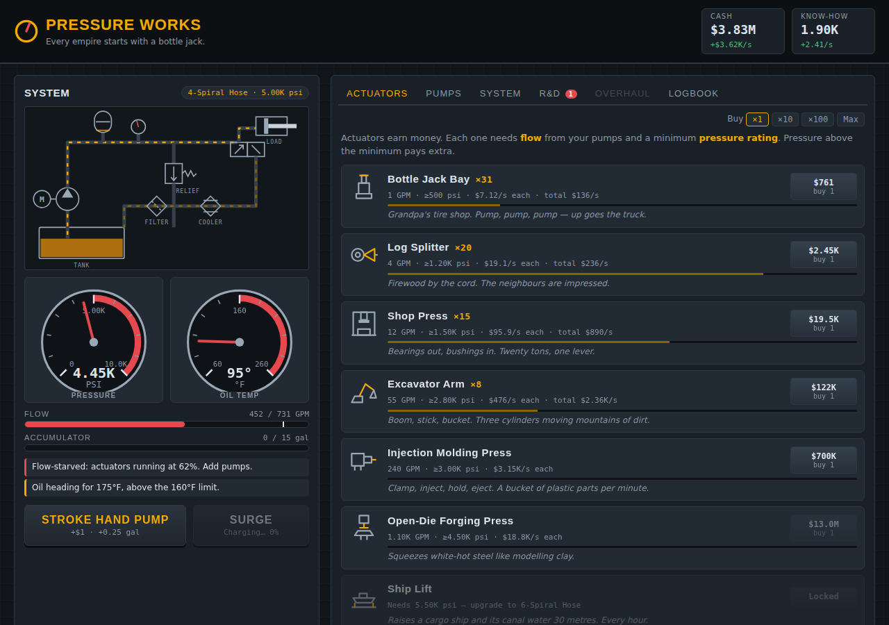

# Pressure Works

*A hydraulic idle game. Every empire starts with a bottle jack.*

You inherit your grandfather's tire shop and its one rusty bottle jack. Pump by
pump and cylinder by cylinder, you grow it into a hydraulic empire. Along the way
you'll balance **flow**, **pressure** and **heat**, the same trade-offs a real
fluid-power engineer deals with.



## Play

There's no build step. Open `index.html` in a browser, or serve the folder:

```bash
python3 -m http.server 8000   # then visit http://localhost:8000
```

**Controls:** `Space` strokes the hand pump · `S` fires Surge · progress autosaves every 10 s.

## How it works (in 30 seconds)

- **Pumps** make flow (GPM). **Actuators** (jacks, presses, excavators, ship lifts…) consume it and earn money.
- The **pressure rating** gates which actuators you can run and multiplies what they pay.
- Too little flow and actuators stall. Too much and the surplus dumps over the **relief valve as heat**.
- Every pump wastes some power as heat too. Buy **coolers** or the oil thins out and income drops.
- Spare flow charges the **accumulator**. Dump it with **Surge** for ×3–×4 income.
- **Know-how** funds a 17-node **R&D tree** of real hydraulic breakthroughs.
- **Overhaul** (prestige) trades everything for **Patents**, each one +10% income forever.

## Project layout

```
index.html          page shell + live schematic SVG
style.css           all styling
src/data.js         every tunable number (pumps, actuators, tiers, coolers, tech, constants)
src/engine.js       pure game logic, no DOM; shared by the browser and the simulator
src/format.js       number/time formatting
src/ui.js           rendering, gauges, animation
src/main.js         load/save, game loop, input
tools/simulate.js   headless balance simulator (a greedy bot plays the real engine)
docs/               design documents and sketches
```

## Design docs

| Doc | Contents |
|---|---|
| [GAME_DESIGN.md](docs/GAME_DESIGN.md) | Pitch, pillars, core loop, every system, eras, presentation |
| [DEPARTMENTS.md](docs/DEPARTMENTS.md) | **Next major system:** the eleven departments as an Order Line, plus Engineering's Valve-Pak / Base-Pak / Sys-Pak lines |
| [ECONOMY.md](docs/ECONOMY.md) | Formulas, content tables, pacing targets vs simulated results |
| [TECH_TREE.md](docs/TECH_TREE.md) | The R&D tree (diagram, effects, real-world background) |
| [ROADMAP.md](docs/ROADMAP.md) | Milestones and open questions |
| [sketches/](docs/sketches/) | Wireframes, a circuit-to-gameplay map, the era map, a departments mockup |

## Balance simulator

```bash
node tools/simulate.js              # 6 simulated hours with a progress report
node tools/simulate.js 8 --overhaul # include prestige resets
```
