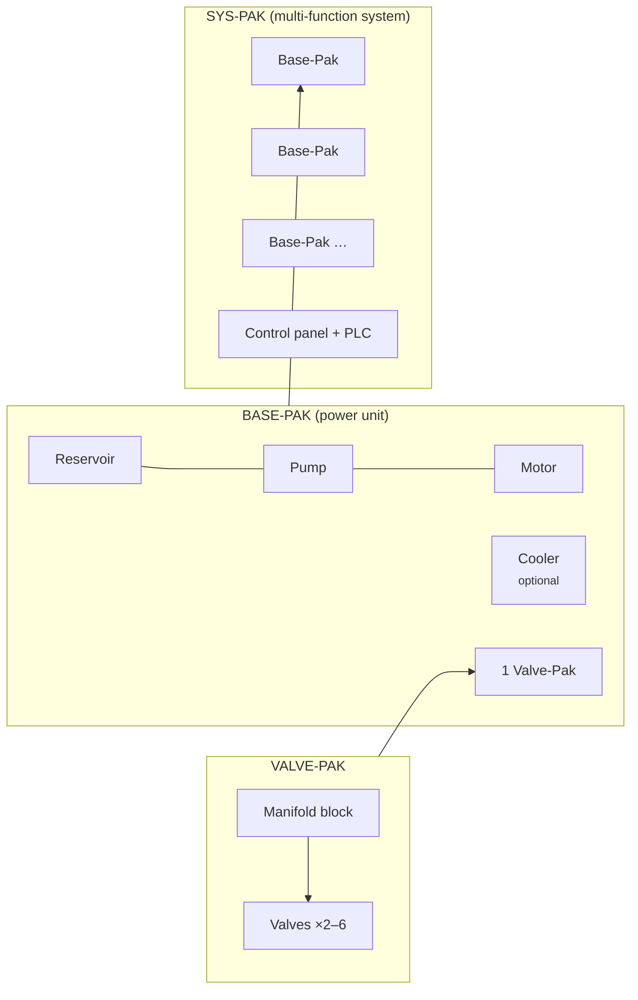

# Departments — the business is a circuit too

> Design v0.3. **Order Line staffing is in the game** (see "How staffing works").
> The support departments and each department's twist are next (see
> [ROADMAP.md](ROADMAP.md)).

## The idea

The shop floor is a hydraulic circuit: pumps push flow, actuators consume it,
and the narrowest point sets the pace. **The company is the same kind of
circuit, but what flows through it is orders.**

Every real fluid-power business runs on eleven departments. In Pressure Works,
seven of them form the **Order Line**, the path an order travels from first
handshake to cash in the bank. The other four are **Support** departments that
change how the whole line behaves, much as coolers, accumulators and R&D do for
the hydraulic circuit.


**Core rule:** the company's realized income is set by its **bottleneck**:

```
realized $/s = min( production $/s,  capacity of every Order Line department )
             × quality yield × support modifiers
```

This is the flow-balance puzzle again, one level up. Buy more presses without
more inside-sales reps and the presses sit idle waiting for orders. The UI shows
it the same way: the Order Line is drawn as a second pipe with each department
as a valve, and the bottleneck valve glows red.

## Department reference

Each department has **headcount** (bought like pumps: base cost × growth^n, with
×2 milestones at 10/25/50/100 staff), a **capacity** in $/s of orders it can
handle, and a few department-specific **upgrades**. Department upgrades are
real business tools, the same way R&D nodes are real hydraulic breakthroughs.

### Order Line

| # | Department | Job in the Order Line | Signature mechanic | Neglect it and… | Example upgrades |
|---|---|---|---|---|---|
| 1 | **Outside Sales** | Finds leads: visits job sites, OEMs, farms, ports | **Markets.** Open new customer segments (Ag → Mobile → Industrial → Marine → Energy → Aerospace). Each market raises *average order value* and wants certain actuators running. | Too few leads; everyone downstream waits | Company truck · Trade-show booth · Key-account program · National accounts |
| 2 | **Inside Sales** | Turns leads into orders: quotes, cross-references, takes POs | **Conversion rate** (starts at 25%). Fast quotes convert better: a *quote-speed* stat that IT and Engineering improve. | Leads pile up and go cold (lost-lead counter) | Cross-reference catalogue · CRM · Same-day quotes · 24/7 counter |
| 3 | **Purchasing** | Buys components and raw stock for every order | **Supplier deals.** Purchasing capacity also lowers *all* equipment prices (it takes over the prototype's Lean Manufacturing tech). | Orders stall waiting for parts | Blanket POs · Preferred-supplier program · Global sourcing · Just-in-time |
| 4 | **Warehouse** | Receives, stocks, picks, packs and ships | **Inventory buffer**, the accumulator of the Order Line. Surplus parts are stocked, and stock covers purchasing hiccups. A full warehouse enables **Rush Ship** (a business-side Surge). | Shipping becomes the bottleneck; no buffer for spikes | Racking · Barcode scanners · Forklift fleet · Automated storage |
| 5 | **Production** | Builds and services: hoses, cylinders, power units | **This is the existing game.** Pumps, actuators, pressure, heat. Production's capacity is the shop floor's $/s. | — (it's the whole hydraulic layer) | Everything in the current shop |
| 6 | **Quality** | Inspects, tests and certifies | **Yield %.** Unchecked orders have a defect rate that comes back as returns (RMAs) and eats income. **Certifications** (ISO 9001 → AS9100) unlock top-tier markets like Aerospace. Ties into the planned contamination system: Quality owns oil cleanliness. | Returns cut revenue; big customers won't buy | Test bench · Particle counter · ISO 9001 · AS9100 · Six Sigma |
| 7 | **Accounting** | Invoices, collects, pays the bills | **Cash timing.** Shipped orders become cash after a *collection delay* (DSO). Accounting shortens it and later earns **interest on the cash balance**. It also prints the offline-earnings "while you were away" report. | Cash arrives late; growth is slower | Invoicing software · Early-pay discounts · Credit line · Treasury desk |

### Support

| Department | What it does | Signature mechanic | Neglect it and… | Example upgrades |
|---|---|---|---|---|
| **Engineering** | Designs systems, programs controls, delivers packaged projects | **Three teams** (see [Engineering in depth](#engineering-in-depth)): *Design* generates Know-how and runs R&D, *Controls* owns the automation and electronics branch, and *Project* builds Valve-Paks, Base-Paks and Sys-Paks, the highest-value orders in the game. | Slow research, no automation, no packaged-system work | CAD seats · Test lab · Panel shop · Project managers |
| **IT** | Keeps the systems running and automates | **Automation.** Hosts PLC auto-Surge, Telematics offline progress, and **ERP**, which adds +% capacity to every Order Line department. Late-game *auto-balance* hires for the bottleneck automatically. | Manual everything; offline progress stays at 50% | Network · ERP · E-commerce portal (Inside Sales boost) · Data lake |
| **Safety** | Protects people and equipment | **Incident rate.** Production at high pressure and heat creates incident risk: a burst hose or a hand injury pauses a line. A **"Days without a lost-time incident"** board grows a stacking bonus that resets on an incident. Higher pressure tiers need safety training first. | Random stoppages; the streak bonus never builds | PPE program · Lockout/tagout · Training center · Safety culture |
| **Management** | Coordinates people | **Span of control.** Each manager can support N staff. If total headcount outgrows management capacity, every department loses efficiency, like an over-pressured circuit. Management also sets a **Focus**: one department at ×2 for a while. Overhaul becomes the *Five-Year Strategic Plan*. | Coordination penalty across the whole company | Team leads · Ops manager · KPIs dashboard · Board of directors |

## Engineering in depth

Engineering is three teams, each with its own headcount and upgrades.

### Design engineering → R&D

Design engineers generate **Know-how**: the prototype's `0.04 × √income`
formula, × (1 + 10% per design engineer). The existing R&D tree is their
backlog. Physics and hydraulics nodes like Pascal, Bernoulli, Seal Chemistry,
Forged Manifolds and Intensifiers are *Design* research.

### Controls engineering → automation and electronics

Controls owns the electro-hydraulic branch of the tree: **Proportional Valves,
Servo Valves, PLC Automation, Load Sensing, Digital Displacement and
Telematics** move under Controls (Telematics is shared with IT). Controls headcount:

- speeds up research of Controls nodes (−5% KH cost per engineer, floor 50%);
- is **required to build Sys-Paks**, which need a control panel and PLC program;
- later adds a *Controls* slot to the planned circuit builder (servo tuning per line).

### Project engineering → the Pak lines

Project engineering turns the shop's own hardware into **packaged products**,
the real product lines of a fluid-power systems house. It's a three-tier
production chain where each tier is built from the one below. That's a classic
idle structure, and each tier is a recognizable piece of real equipment.



| Pak | What it really is | Built from | Requires | Sells for (relative) |
|---|---|---|---|---|
| **Valve-Pak** | Manifold with its valves only: a drop-in hydraulic control block | Manifold + valves (Purchasing supplies them) | Project team; *Forged Manifolds* gives a big bonus | 1× |
| **Base-Pak** | Simple power unit: reservoir, pump, motor, a valve or two, sometimes a cooler | 1 Valve-Pak + 1 pump of the current best type + reservoir/motor kit; +1 cooler for the "cooled" variant | Project team; pump tier sets the Base-Pak grade | ~8× (cooled: ~12×) |
| **Sys-Pak** | Complex multi-function system built from several Base-Paks plus controls | 2–6 Base-Paks + control panel | Project **and** Controls headcount; PLC Automation | ~60–200× |

**How it plays:**

- Each Pak line has a **build queue** with engineering hours per unit. Project
  engineers add hours per second, the way pumps add GPM.
- Building a Base-Pak **consumes** a Valve-Pak from stock, and a Sys-Pak consumes
  Base-Paks. The player chooses: sell Valve-Paks now for quick cash, or hold them
  to climb the chain. Warehouse capacity limits how many sit in stock.
- Finished Paks are **orders** that travel the rest of the Order Line (Quality
  inspects, Accounting invoices), so Pak revenue is still capped by the bottleneck.
- A Base-Pak's grade (gear → vane → piston → load-sensing…) follows the best
  pump the shop owns, and a cooled Base-Pak needs coolers researched. The
  hydraulic layer and the business layer feed each other.
- **Sys-Pak projects** are the endgame contracts: named jobs ("Steel-mill
  descaler system: 4 Base-Paks, 6,000 psi, servo control") with a deadline and a
  large lump-sum payout plus Patents-adjacent rewards. They replace the generic
  contracts board idea in the earlier roadmap.

**Opening the chain over time:** Valve-Pak opens with Engineering (Era IV).
Sys-Pak needs PLC Automation and at least one controls engineer. (Implemented
with simpler rules: see *Pak lines (implemented)* below. Named Sys-Pak
contracts with deadlines are still to build.)

## How it changes the loop

```
Before:  pumps ⇄ actuators ⇄ heat                     → $/s
After:   pumps ⇄ actuators ⇄ heat  =  Production $/s
         Outside → Inside → Purchasing → Warehouse → [Production] → Quality → Accounting
         bottleneck × yield × support modifiers        → $/s
```

- The hydraulic layer stays the heart of the game, and it's what you play in Era I.
- Departments **open one at a time** so players never face eleven new things at
  once. Each has a short story beat when it opens:

| Era | Departments that open | Opens when (any of) | Story beat |
|---|---|---|---|
| I · First Shop | Production | start | It's you, a bottle jack, and one ledger in Cedar Rapids. |
| II · Job Shop | Inside Sales, Accounting | $1K earned | The phone won't stop ringing, and somebody has to send invoices. |
| III · Factory | Purchasing, Warehouse, Quality, Safety | 2-Wire Braid (3,000 psi) or $100K earned | Parts by the pallet. The first customer audit. The first close call. |
| IV · Heavy Civil | Outside Sales, Engineering, IT | $10M earned | You stop waiting for work and go get it. |
| V · Megaprojects | Management | $1B earned or first Overhaul | Two hundred people. Somebody has to run this. |

These conditions live in `src/data.js` (`DEPARTMENTS[].opens`) and drive the
Company tab that's already in the game.

- Until a department opens, its stage counts as *unlimited capacity* (the owner
  is doing it), so the formula works from minute one.

## UI

**In the game now (placeholder):** a **Company** tab lists all eleven
departments: the Order Line as numbered steps 1–7, the Support departments, and
the Pak chain. Each card shows the department's job, its twist, its era, and
either *Open · owner-run* or what it takes to open it, with a progress bar.
Production is highlighted and links back to the shop. Nothing on the tab affects
income yet.

**Target (see [sketches/departments.svg](sketches/departments.svg)):**

- The Order Line is drawn as a pipe. Each department is a valve whose opening
  width shows its capacity relative to production. The narrowest valve is the
  bottleneck and glows red.
- Click a department to see headcount, capacity, its upgrades and its signature meter
  (conversion %, inventory, yield %, DSO, incident streak…).
- Support departments sit above the pipe like the accumulator and gauges on
  the hydraulic schematic.

## How staffing works (implemented, v0.2)

The seven Order Line departments are in the game. Six of them are staffed;
Production is the shop floor itself. Support departments and the
department-specific twists come next.

- **Opening:** each department opens on its own as the company grows, and you
  cover it yourself at first (staff 1). The game remembers how much the shop was
  producing at that moment.
- **Growing pains:** every time production grows 10× beyond that, the
  department needs **4 more staff-equivalents**. Its **coverage** is
  (you + team strength) ÷ needed; see *Hiring people* below.
- **The bottleneck:** the Order Line runs at the coverage of its weakest
  department. Income is `production × that factor`, and it never drops below 10%.
- **Surplus staff pay off:** coverage above 100% isn't wasted. Each department
  earns **+15% × (1 − 1/coverage)** income: +5% at 150%, +7.5% at 200%, +11% at
  400%, approaching +15% (so +90% across the Order Line at most). There's no flat
  cap, so more output always helps a little. Managers, IT,
  Management and strong hires all raise output, so every team bonus shows up in
  income even when nothing is a bottleneck. Surplus also buffers the next 10× of
  growth before the department becomes a bottleneck again.
- **Hiring:** the nth hire costs `10 s × opening production × 1.778^n`. Because
  1.778⁴ = 10, that works out to roughly **10 seconds of current production per
  hire you need**, whenever you need it. Hiring never gets trivially cheap
  or impossibly expensive.
- **Locations help Outside Sales:** each rep's reach is multiplied by
  `√(customer base ÷ HQ's)`. Opening North makes every rep count ×1.58, West
  ×2.24 and South ×3.16. Locations widen the market, and Outside Sales covers it.
- **Overhaul** resets staff. Departments reopen at the new run's (tiny)
  production, so each run you staff up again as you grow.
- **People UI (v0.2.5):** department cards are compact: status, coverage, a row of
  headshots (manager first) and a quick hire. Tapping a card opens its **focus
  sheet** (a bottom sheet on phones): plain-language health, where the output
  comes from, the two stats that matter there, the manager's effects, the team
  and applicants as headshots. Tapping any face opens an **ID badge** with all
  eight stats explained, their fit for the job, their quirk, what they'd do as
  manager, and Hire / Promote / team buttons.
- **UI:** on the Company tab each card shows coverage (an amber segment for surplus),
  output vs needed with the manager/IT/Management boosts that make it up, any surplus bonus, and a
  hire button that follows the ×1/×10/×100/Max picker. The bottleneck card turns
  red, a **Staff the line to 100%** button prices the whole fix up front, and
  alerts plus the machine's overlay name the short-staffed department.

**Pacing impact** (balance simulator): $1M at 21 min (was 18), $1B at 82 min
(was 75), end-of-run income unchanged.

## Hiring people (implemented, v0.2.1)

Hires are people, not head counts.

- **Applicants:** each open department has **3 applicants** waiting. Each is a
  random person with a name, a look, seven stats (1–10) and, a third of the time,
  a **quirk**.
- **Stats:** Hustle, Rapport, Negotiation, Organization, Precision, Numbers and
  Mechanical. Each department weighs two of them, with the first counting double:

| Department | Primary | Secondary | Quirks that help here |
|---|---|---|---|
| Outside Sales | Hustle | Rapport | Single-digit golf handicap, Knows every OEM in Iowa, Grew up on a farm |
| Inside Sales | Rapport | Mechanical | Cross-references from memory, Bilingual, Former diesel mechanic |
| Purchasing | Negotiation | Numbers | Never pays list price, Spreadsheet wizard |
| Warehouse | Organization | Hustle | Forklift certified, Packs a truck like Tetris, Night-shift legend |
| Quality | Precision | Mechanical | Ex-Navy hydraulics tech, Six Sigma Green Belt |
| Accounting | Numbers | Precision | CPA, Collects invoices relentlessly |
| Any | | | Makes the good coffee, Natural mentor, 30 years in fluid power |

- **Effectiveness:** `0.45 + 0.11 × (2 × primary + secondary) / 3 + quirk bonus`.
  An average person counts as about **1.05 staff**, a star up to about **1.9**,
  and a poor fit about 0.55. The same person can be a star in Purchasing and
  average in the Warehouse.
- **Team strength** (the sum of everyone's effectiveness) replaces head count
  in coverage. Hire **cost** still depends on head count, so a strong hire is
  pure upside.
- **Ways to hire:**
  - **Hire** a specific applicant; a new applicant takes their place.
  - **Hire best ×N** always takes the strongest applicant available.
  - **New applicants** rerolls all three for ~3 s of production.
  - **Staff the line to 100%** hires the best available into every lagging
    department, priced exactly up front.
- **Determinism:** applicants come from a seeded random stream stored in the
  save, so a quote is exactly what you pay and get.
- **Older saves:** generic hires from before this change keep counting as 1.0 each.
- **On screen:** your people appear in the office row of The Works (the three
  strongest at the desks, "+N" for the rest) and on the warehouse floor (packer
  and pickers).

## Managers (implemented, v0.2.2)

- **Leadership (LEA)** is an eighth stat. People hired before it existed get one
  derived from their look.
- **Promoting:** anyone on a team can be promoted to **manager**. They leave the
  head count but lift the whole team. Promoting someone else returns the old
  manager to the team.
- **What a manager does,** scaled by Leadership:

| | Formula | LEA 3 | LEA 9 |
|---|---|---|---|
| Team strength (the manager still counts as a worker) | × (1 + 5% × LEA) | +15% | +45% |
| Applicants reviewed | 3 + ⌊LEA / 3⌋ | 4 | 6 |
| Hires per staffing check (every 2 s) | 1 + ⌊LEA / 4⌋ | 1 | 3 |

- **Auto-staff** (on by default, toggle on the card): whenever their department
  drops below 100% coverage, the manager hires the best applicant they're
  screening, paying the normal hire cost. Managers keep head count where it
  needs to be, and better managers pick better people and fill gaps faster.
- **Team reviews (v0.3.0):** with auto-staff on, every 15 s each manager (support
  departments too) lets their weakest person go when an applicant beats them by
  `max(0.2, 0.6 − 0.04 × LEA)` effectiveness, paying half a hire, at most 0.5% of
  cash. Head count stays the same; the last few swaps show on the manager card.
- **Promote for Leadership, not effectiveness:** a high-LEA person with mediocre
  job stats makes the best manager. Managers keep doing their own job, so a
  promotion never lowers a team's output.

## Engineering (implemented, v0.2.2)

- **Opening:** Engineering opens at $10M earned and hires like the Order Line
  departments, weighing Mechanical first and Numbers second. Its quirks are
  *Licensed P.E.* and *Builds test rigs in the garage*. It isn't part of the
  Order Line, so it never becomes the bottleneck.
- **Three teams (v0.2.5).** Every engineer, the manager included, works on one
  team; new hires join the smallest one, and you move people from their ID badge.
  Team strength = effectiveness × manager × Management, like any department.
  - **Design:** each staff-equivalent adds **5% Know-how** (people hired before
    teams existed, and "you", are on Design).
  - **Controls:** the six Controls nodes (Proportional Valves, Load Sensing, PLC,
    Servo, Telematics, Digital Displacement) cost **−5% Know-how per
    staff-equivalent**, down to half price. Strength 1+ is needed for Sys-Paks.
  - **Project:** runs the Pak lines (below).
- **Engineering projects** are one-time cash purchases that need enough engineers:

| Project | Engineers | Cost | Know-how |
|---|---:|---:|---:|
| CAD Workstations | 1 | $2M | ×1.25 |
| Hydraulic Test Lab | 3 | $30M | ×1.5 |
| Simulation (FEA / CFD) | 6 | $500M | ×1.5 |
| Application Engineers | 10 | $8B | ×1.75 |
| R&D Center | 16 | $150B | ×2 |

- **Effect on pacing:** with Engineering staffed, the balance bot finishes the
  R&D tree around 2h instead of 3.5h, and end-of-run income is unchanged.
- **Overhaul** resets projects, staff and the Pak line, like everything else in a run.

### SCADA (implemented, v0.2.9)

Controls' high-level system. Install it with **2M Know-how** once Telematics is
researched and the Controls team has strength 2+ (the SCADA button on the control
panel opens the screen either way and shows what's missing). Overhaul uninstalls
it, but your automation switches are remembered.

- **Cockpit:** a full-screen control-room view (always dark). **Digital gauges**
  for income, pressure and oil temperature: a big readout, a status lamp (e.g.
  RATED / RELIEF, NORMAL / RISING / HIGH / OVER LIMIT, BALANCED / STARVED), a range
  bar with normal / warning / alarm zones, and a sparkline (1 minute, or 5 with the
  historian; time-based, so a fresh install fills the strip). Below them: live tiles
  (income and its % change per minute, production and the Order Line, pressure, oil
  temperature, flow, accumulator, heat balance, Know-how, the Pak line, safety) and
  the alarm list. Axes and readouts use the game's number format and switch to a log
  scale on their own, so 1e40 $/s reads cleanly.
- **Operator panel (v0.3.1):** four upgrades bought in order with Know-how; each
  adds to the screen and pays off in play. They go with the SCADA install at Overhaul.

| Upgrade | Know-how | On screen | Effect |
|---|---:|---|---|
| Trend historian | 5M | 5-minute sparklines with low/high; the four trend charts | Income +5% (on top of loop tuning) |
| Alarm management | 20M | Flow, accumulator and heat-load gauges | Incidents −20% |
| Predictive analytics | 80M | Next-minute forecast on every sparkline; rates of change | Automation +1 action per scan |
| Advanced process control | 300M | — | Loop tuning doubled: +1% per Controls strength, up to +40% |

- **Loop tuning:** all income **+0.5% per Controls strength**, up to +20%.
- **Autonomous control** (each switch off until you turn it on), scanning every
  2 s with `1 + Controls strength ÷ 3` actions per scan, each spending at most 1%,
  5% or 20% of cash (your choice):
  - **Best return per $ (v0.3.3):** each action prices every option the switches
    allow and measures what it adds to *sustained* production (accumulator empty,
    oil at equilibrium, so a charged accumulator can't hide a flow shortage, and
    milestones, heat and relief all count). It buys the best gain per $ within the
    budget, and logs the gain, the cost and the payback time.
  - *Auto-lines* offers every unlocked actuator; with *Auto-pumps* on, a line that
    would outrun the flow comes bundled with the pumps to feed it.
  - *Auto-pumps* also offers single pumps while the plant is starved.
  - *Auto-cooling* still keeps equilibrium within 5°F of the limit first (safety),
    and offers coolers whenever heat is costing output.
  - *Auto-tier & accumulator* offers the next pressure tier like any other buy; the
    accumulator (no steady revenue of its own) only when no revenue buy fits.
  - **Order Line aware:** while short staffing caps income, growth is put on hold
    (more machines would earn nothing); the log says which department is short and
    when growth resumes. Cooling keeps running.
  Every automated purchase is logged on the screen. Automation runs in the game
  loop whether or not the screen is open, but not while the game is closed.

### Pak lines (implemented, v0.2.5)

- **Hours:** the Project team adds `√(Project strength)` engineering hours per
  second (big teams coordinate less well, so the line keeps growing but never
  runs away).
- **The chain:** you pick a target; the line builds whatever it needs first and
  sells each finished target through the Order Line:

| Pak | Hours | Uses | Sells for | Grade |
|---|---:|---|---|---|
| Valve-Pak | 300 | — | 10 s of production | ×1.5 with Forged Manifolds |
| Base-Pak | 1,500 | 1 Valve-Pak | 6 × 10 s | +10% per pump type above gear |
| Sys-Pak | 6,000 | 4 Base-Paks | 60 × 10 s | same; needs PLC Automation + Controls strength 1 |

- **Why climb:** per engineering hour, a Base-Pak pays ~1.5× a Valve-Pak and a
  Sys-Pak ~2× (with a good pump grade). Prices follow production × the Order
  Line factor, so a bottleneck also slows Pak revenue.
- **UI:** the Company tab shows each Pak's price, hours, stock and build
  progress, a "Build these" button, and the line's hours/s and average $/s.

## Executive track (implemented, v0.2.6)

Above the managers sits a C-suite that runs whole divisions, then a President,
then a Board of Directors. They open with Management ($1B earned or your first
Overhaul) and appear as an org chart under **Leadership** on the Company tab.

| Seat | Division | Key stat |
|---|---|---|
| **CRO** Chief Revenue Officer | Outside Sales, Inside Sales | Rapport |
| **COO** Chief Operating Officer | Warehouse, Quality, Safety | Organization |
| **CFO** Chief Financial Officer | Accounting, Purchasing | Numbers |
| **CTO** Chief Technology Officer | Engineering, IT | Mechanical |
| **President** | Management, plus every executive | Organization |

- **Skill** = `(2 × Leadership + key stat) ÷ 3` (about 1–10), plus +1 per 3
  President skill and +1 from an Executive coach on the Board.
- **Appointing:** promote anyone from the division for free (a manager leaves a
  gap the executive fills on their next round), or hire one of three outside
  candidates (Leadership and key stat +2) for 10 minutes of production.
- **Division boost:** every team in the division works **+3% per skill point**.
- **Every 5 seconds** an executive takes `1 + skill ÷ 3` actions, each spending at
  most `0.2% + 0.1% × skill` of your cash:
  1. make the best leader each team's manager (or replace a manager when someone
     has 2+ more Leadership);
  2. hire Order Line teams up to `100% + 2% × skill` coverage, and top up support
     teams while hires are cheap;
  3. replace the weakest person with a clearly better applicant (the gap needed
     is `0.45 − 0.03 × skill` staff; the swap costs half a hire);
  4. refresh an applicant pool with nobody better than the team's average.
  Their recent decisions are listed in their sheet.
- **President:** named from your executives once three are seated (their seat
  opens up). All income **+2% per skill point**, every executive +1 skill per 3
  President skill, and Management +3% per skill point.
- **The President reviews the C-suite (v0.3.0)** every 30 s, one change per
  review: a vacant seat goes to the best person in its division (skill 4+), and
  a seated executive is replaced when someone in the division would be
  `max(1, 3 − ⌊President skill ÷ 4⌋)` skill better. The outgoing executive takes
  the newcomer's old job (manager seat or team spot). A seat you leave empty is
  filled on the next review.
- **Board of Directors:** opens after 2 Overhauls or $1T earned. Five seats cost
  **3, 8, 20, 50 and 120 Patents** (gone for good, and not refunded by the next
  Overhaul). Each seat offers three candidates with one perk each: income +10%,
  Pak prices +25%, Outside Sales reach ×1.25, equipment −8%, Know-how +25%,
  incidents −35%, Order Line need −10%, +1 applicant everywhere, or every
  executive +1 skill. **Directors stay through Overhaul.**
- **Overhaul** resets executives and the President (they are part of the run),
  but not the Board.
- **Director strength:** a director's perk scales with their Leadership:
  `1 + (perk − 1) × (0.6 + 0.08 × LEA)`, so ×1.0 at LEA 5 and ×1.4 at LEA 10.
- **The Chair (v0.3.0):** with 2+ directors, the strongest leader chairs the
  Board and keeps watch. When someone on a team (or a manager) has 2+ more
  Leadership than the weakest other director, the Chair proposes a swap for a
  quarter of that seat's Patent price (min 1, spent for good). The seat keeps its
  perk, the old director retires and the newcomer leaves their job. You approve
  each swap.

### Shake-up (implemented, v0.2.7)

A shake-up is a timed, top-down reorganization you start from the Leadership
section. It costs 2 minutes of production and then cools down for 30 minutes.

**Goal seek (v0.3.4).** Every seat in the company is a slot: Board seats, the four
executive seats, the President, each department's manager seat and every team
position. Each phase hill-climbs: it tries moving the most promising people from
**anywhere in the company** into its slots (swapping the current holder into the
mover's old place, or filling an empty seat), measures the result with the real
economy (`shakeScore()`: steady income plus Pak sales, Know-how rate, incident risk,
Controls strength and the equipment cost multiplier) and keeps the move with the
biggest gain. A move is kept only if **no measure gets worse** and at least one gets
better (income counts most); it repeats until nothing helps.

| Phase | Time | Slots it fills | Candidates tried |
|---|---:|---|---|
| Board | 45 s | Board seats (each keeps its perk; a replaced director takes the newcomer's old job) | 10 best leaders anywhere |
| Executives | 60 s | C-suite seats and the President | 10 best by projected skill anywhere |
| Managers | 60 s | Every manager seat; any seat still empty then goes to its team's best leader if nothing gets worse (managers also hire and review) | 12 best leaders anywhere |
| Employees | 120 s | Team positions: pairwise swaps between departments, the most promising 60 tested each step, up to 400 swaps | everyone on a team |

**Free instant reorg (v0.3.5):** once per save, the same goal seek runs in one go
with no cost, no disruption and no cooldown (a paid shake-up stays available). The
flag (`s.shake.freeUsed`) survives Overhaul.

While it runs, **incidents are 3× likelier** and Order Line teams work at **90%**.
At the end you get a report (moves made and the change in income), and every move
is listed in the shake-up card with its gain.

## Support departments and Purchasing (implemented, v0.2.3)

Every department is now hireable. The support departments sit outside the Order
Line, so they never become the bottleneck. Instead, each changes how the whole
company runs:

| Department | Opens | Stats (primary / secondary) | Effect |
|---|---|---|---|
| **IT** | $10M | Numbers / Organization | Every Order Line department's strength **+4% per IT staff-equivalent** (max +100%) |
| **Safety** | 3,000 psi or $100K | Precision / Organization | Incidents ÷ (1 + 0.25 × strength); see below |
| **Management** | $1B or first Overhaul | Leadership / Organization | Every team **+2% per staff-equivalent** (max +50%), plus **+1 applicant** in every department per 6 strength |
| **Purchasing** (Order Line twist) | 3,000 psi or $100K | Negotiation / Numbers | Equipment prices ÷ (1 + 1% × strength), floored at ×0.7 |

**Incidents (Safety):**
- From 3,000 psi up, incidents happen at about 0.3 per minute ×
  (psi ÷ 3,000) × heat, divided by Safety strength as above.
- An incident (burst hose, blown seal, near miss) shuts **one actuator line for
  30 s**. The station shows LINE DOWN, an alert names it, and a bong sounds.
- Every 10 minutes without an incident is a **day safe**, worth **+1% income**
  (max +25%). An incident resets the streak. The Safety office's board shows
  the count.

**Ideas next:** an HR or Management upgrade for 4–5 applicants or better stats; a
morale or mentor effect; named "Employee of the Month" bonuses; retirements
across Overhauls (a Hall of Fame).

## Still to build

| Department | Twist (from the design above) |
|---|---|
| Outside Sales | Markets: one-time purchases that raise order value |
| Inside Sales | Conversion rate |
| Purchasing | ✓ Supplier discounts on equipment (v0.2.3) |
| Warehouse | Inventory buffer and Rush Ship |
| Quality | Yield, certifications, contamination |
| Accounting | Collection delay (DSO) and interest |
| Engineering | Design (Know-how) ✓, Controls (automation tech), Project (Pak lines) |
| IT · Safety · Management | ✓ (v0.2.3) |

## Build plan (when we implement)

1. **State:** `departments: { [id]: { staff, p0, upgrades: {} } }`,
   `engineering: { design, controls, project }`, `paks: { valve, base, sys }`,
   `receivables`, `incidentStreak`. `deserialize()` already merges new keys, so
   existing saves keep working.
2. **Engine:** `derive()` keeps today's figure as `productionIncome` and adds
   the Order Line on top as a separate step, so the hydraulic layer stays
   testable on its own.
3. **Tech migration:** Lean Manufacturing → Purchasing. Proportional, Servo,
   PLC, Load Sensing, Digital Displacement and Telematics are tagged
   `branch: 'controls'`, and the rest `branch: 'design'`. The tree itself doesn't change.
4. **Simulator:** add "hire for the bottleneck" candidates to the bot, then
   re-check that the pacing table in ECONOMY.md moves by no more than about 25%.
5. **UI:** turn the placeholder cards into the valve diagram, with a hire
   button and signature meter on each card.

## Balancing intent

- **Bottleneck, not tax.** No salaries or upkeep. Hiring is a one-time cost,
  so departments never drain cash while offline. Neglect costs you throughput,
  never money you already had.
- **One clear red valve.** At most one department should be the obvious
  bottleneck at a time, and its alert says exactly whom to hire.
- **Each department has one twist** beyond capacity (markets, conversion,
  supplier discounts, inventory buffer, yield, cash timing, incidents, span of
  control) so they don't all feel like the same "+% button".
- **Automation earns its place.** IT's auto-balance arrives late, after
  players have felt the puzzle by hand.

## Open questions

- Should department heads be named characters? It adds charm. If this is pitched
  internally, they could be placeholders that real teams name themselves
  (fictional names by default; no real employees without consent).
- Should the existing R&D tab move under Engineering in the UI, or stay
  top-level for discoverability?
- Should Warehouse inventory decay (obsolete stock) to stop players overbuilding it?
- Locations are designed in [TERRITORY.md](TERRITORY.md). Every location is an
  extension of HQ with the same departments and processes, and adds customer
  base, which caps demand.
