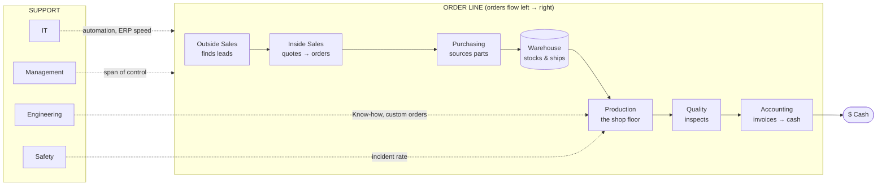
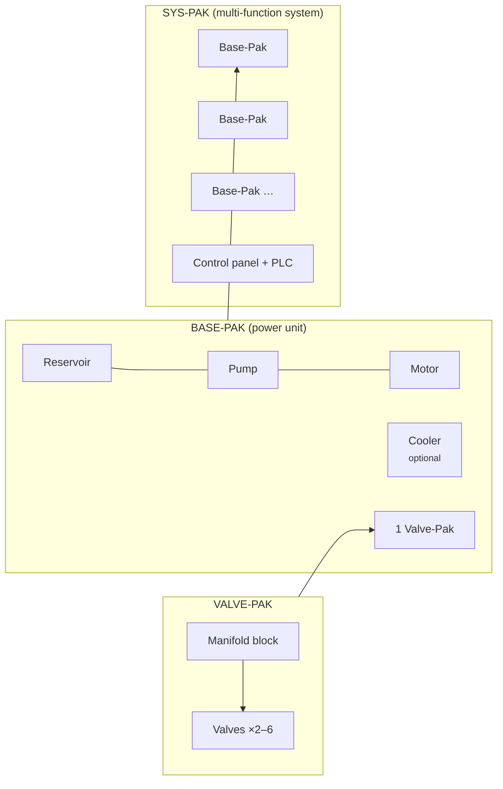

# Departments — the business is a circuit too

> Design v0.1 for the Departments system. Not in the prototype yet; it's the next
> major milestone (see [ROADMAP.md](ROADMAP.md)).

## The idea

The shop floor is a hydraulic circuit: pumps push flow, actuators consume it,
and the narrowest point sets the pace. **The company is the same kind of
circuit, but what flows through it is orders.**

Every real fluid-power business runs on eleven departments. In Pressure Works,
seven of them form the **Order Line**, the path an order travels from first
handshake to cash in the bank. The other four are **Support** departments that
change how the whole line behaves, much as coolers, accumulators and R&D do for
the hydraulic circuit.



**Core rule:** the company's realized income is set by its **bottleneck**:

```
realized $/s = min( production $/s,  capacity of every Order Line department )
             × quality yield × support modifiers
```

This is the flow-balance puzzle again, one level up. Buy more presses without
more inside-sales reps and the presses sit idle waiting for orders. The UI shows
it the same way: the Order Line is drawn as a second pipe with each department
as a valve, and the bottleneck valve glows red.

## Department reference

Each department has **headcount** (bought like pumps: base cost × growth^n, with
×2 milestones at 10/25/50/100 staff), a **capacity** in $/s of orders it can
handle, and a few department-specific **upgrades**. Department upgrades are
real business tools, the same way R&D nodes are real hydraulic breakthroughs.

### Order Line

| # | Department | Job in the Order Line | Signature mechanic | Neglect it and… | Example upgrades |
|---|---|---|---|---|---|
| 1 | **Outside Sales** | Finds leads: visits job sites, OEMs, farms, ports | **Markets.** Open new customer segments (Ag → Mobile → Industrial → Marine → Energy → Aerospace). Each market raises *average order value* and wants certain actuators running. | Too few leads; everyone downstream waits | Company truck · Trade-show booth · Key-account program · National accounts |
| 2 | **Inside Sales** | Turns leads into orders: quotes, cross-references, takes POs | **Conversion rate** (starts at 25%). Fast quotes convert better: a *quote-speed* stat that IT and Engineering improve. | Leads pile up and go cold (lost-lead counter) | Cross-reference catalogue · CRM · Same-day quotes · 24/7 counter |
| 3 | **Purchasing** | Buys components and raw stock for every order | **Supplier deals.** Purchasing capacity also lowers *all* equipment prices (it takes over the prototype's Lean Manufacturing tech). | Orders stall waiting for parts | Blanket POs · Preferred-supplier program · Global sourcing · Just-in-time |
| 4 | **Warehouse** | Receives, stocks, picks, packs and ships | **Inventory buffer**, the accumulator of the Order Line. Surplus parts are stocked, and stock covers purchasing hiccups. A full warehouse enables **Rush Ship** (a business-side Surge). | Shipping becomes the bottleneck; no buffer for spikes | Racking · Barcode scanners · Forklift fleet · Automated storage |
| 5 | **Production** | Builds and services: hoses, cylinders, power units | **This is the existing game.** Pumps, actuators, pressure, heat. Production's capacity is the shop floor's $/s. | — (it's the whole hydraulic layer) | Everything in the current shop |
| 6 | **Quality** | Inspects, tests and certifies | **Yield %.** Unchecked orders have a defect rate that comes back as returns (RMAs) and eats income. **Certifications** (ISO 9001 → AS9100) unlock top-tier markets like Aerospace. Ties into the planned contamination system: Quality owns oil cleanliness. | Returns cut revenue; big customers won't buy | Test bench · Particle counter · ISO 9001 · AS9100 · Six Sigma |
| 7 | **Accounting** | Invoices, collects, pays the bills | **Cash timing.** Shipped orders become cash after a *collection delay* (DSO). Accounting shortens it and later earns **interest on the cash balance**. It also prints the offline-earnings "while you were away" report. | Cash arrives late; growth is slower | Invoicing software · Early-pay discounts · Credit line · Treasury desk |

### Support

| Department | What it does | Signature mechanic | Neglect it and… | Example upgrades |
|---|---|---|---|---|
| **Engineering** | Designs systems, programs controls, delivers packaged projects | **Three teams** (see [Engineering in depth](#engineering-in-depth)): *Design* generates Know-how and runs R&D, *Controls* owns the automation and electronics branch, and *Project* builds Valve-Paks, Base-Paks and Sys-Paks, the highest-value orders in the game. | Slow research, no automation, no packaged-system work | CAD seats · Test lab · Panel shop · Project managers |
| **IT** | Keeps the systems running and automates | **Automation.** Hosts PLC auto-Surge, Telematics offline progress, and **ERP**, which adds +% capacity to every Order Line department. Late-game *auto-balance* hires for the bottleneck automatically. | Manual everything; offline progress stays at 50% | Network · ERP · E-commerce portal (Inside Sales boost) · Data lake |
| **Safety** | Protects people and equipment | **Incident rate.** Production at high pressure and heat creates incident risk: a burst hose or a hand injury pauses a line. A **"Days without a lost-time incident"** board grows a stacking bonus that resets on an incident. Higher pressure tiers need safety training first. | Random stoppages; the streak bonus never builds | PPE program · Lockout/tagout · Training center · Safety culture |
| **Management** | Coordinates people | **Span of control.** Each manager can support N staff. If total headcount outgrows management capacity, every department loses efficiency, like an over-pressured circuit. Management also sets a **Focus**: one department at ×2 for a while. Overhaul becomes the *Five-Year Strategic Plan*. | Coordination penalty across the whole company | Team leads · Ops manager · KPIs dashboard · Board of directors |

## Engineering in depth

Engineering is three teams, each with its own headcount and upgrades.

### Design engineering → R&D

Design engineers generate **Know-how**: the prototype's `0.04 × √income`
formula, × (1 + 10% per design engineer). The existing R&D tree is their
backlog. Physics and hydraulics nodes like Pascal, Bernoulli, Seal Chemistry,
Forged Manifolds and Intensifiers are *Design* research.

### Controls engineering → automation and electronics

Controls owns the electro-hydraulic branch of the tree: **Proportional Valves,
Servo Valves, PLC Automation, Load Sensing, Digital Displacement and
Telematics** move under Controls (Telematics is shared with IT). Controls headcount:

- speeds up research of Controls nodes (−5% KH cost per engineer, floor 50%);
- is **required to build Sys-Paks**, which need a control panel and PLC program;
- later adds a *Controls* slot to the planned circuit builder (servo tuning per line).

### Project engineering → the Pak lines

Project engineering turns the shop's own hardware into **packaged products**,
the real product lines of a fluid-power systems house. It's a three-tier
production chain where each tier is built from the one below. That's a classic
idle structure, and each tier is a recognizable piece of real equipment.



| Pak | What it really is | Built from | Requires | Sells for (relative) |
|---|---|---|---|---|
| **Valve-Pak** | Manifold with its valves only: a drop-in hydraulic control block | Manifold + valves (Purchasing supplies them) | Project team; *Forged Manifolds* gives a big bonus | 1× |
| **Base-Pak** | Simple power unit: reservoir, pump, motor, a valve or two, sometimes a cooler | 1 Valve-Pak + 1 pump of the current best type + reservoir/motor kit; +1 cooler for the "cooled" variant | Project team; pump tier sets the Base-Pak grade | ~8× (cooled: ~12×) |
| **Sys-Pak** | Complex multi-function system built from several Base-Paks plus controls | 2–6 Base-Paks + control panel | Project **and** Controls headcount; PLC Automation | ~60–200× |

**How it plays:**

- Each Pak line has a **build queue** with engineering hours per unit. Project
  engineers add hours per second, the way pumps add GPM.
- Building a Base-Pak **consumes** a Valve-Pak from stock, and a Sys-Pak consumes
  Base-Paks. The player chooses: sell Valve-Paks now for quick cash, or hold them
  to climb the chain. Warehouse capacity limits how many sit in stock.
- Finished Paks are **orders** that travel the rest of the Order Line (Quality
  inspects, Accounting invoices), so Pak revenue is still capped by the bottleneck.
- A Base-Pak's grade (gear → vane → piston → load-sensing…) follows the best
  pump the shop owns, and a cooled Base-Pak needs coolers researched. The
  hydraulic layer and the business layer feed each other.
- **Sys-Pak projects** are the endgame contracts: named jobs ("Steel-mill
  descaler system: 4 Base-Paks, 6,000 psi, servo control") with a deadline and a
  large lump-sum payout plus Patents-adjacent rewards. They replace the generic
  contracts board idea in the earlier roadmap.

**Opening the chain over time:** Valve-Pak opens with Engineering (Era IV).
Base-Pak opens after the first Valve-Pak ships. Sys-Pak needs PLC Automation and
at least one controls engineer.

## How it changes the loop

```
Before:  pumps ⇄ actuators ⇄ heat                     → $/s
After:   pumps ⇄ actuators ⇄ heat  =  Production $/s
         Outside → Inside → Purchasing → Warehouse → [Production] → Quality → Accounting
         bottleneck × yield × support modifiers        → $/s
```

- The hydraulic layer stays the heart of the game, and it's what you play in Era I.
- Departments **open one at a time** so players never face eleven new things at
  once. Each has a short story beat when it opens:

| Era | Departments that open | Story beat |
|---|---|---|
| I · Tire Shop | Production | It's you, a bottle jack, and Grandpa's ledger. |
| II · Job Shop | Inside Sales, Accounting | The phone won't stop ringing, and somebody has to send invoices. |
| III · Factory | Purchasing, Warehouse, Quality, Safety | Parts by the pallet. The first customer audit. The first close call. |
| IV · Heavy Civil | Outside Sales, Engineering, IT | You stop waiting for work and go get it. |
| V · Megaprojects | Management | Two hundred people. Somebody has to run this. |

- Until a department opens, its stage counts as *unlimited capacity* (the owner
  is doing it), so the formula works from minute one.

## UI sketch

A new **Company** tab, drawn as a pipe diagram (see
[sketches/departments.svg](sketches/departments.svg)):

- The Order Line is a horizontal pipe. Each department is a valve whose opening
  width shows its capacity relative to production. The narrowest valve is the
  bottleneck and glows red.
- Click a department to see headcount, capacity, its upgrades and its signature meter
  (conversion %, inventory, yield %, DSO, incident streak…).
- Support departments sit above the pipe like the accumulator and gauges on
  the hydraulic schematic.

## Balancing intent

- **Bottleneck, not tax.** No salaries or upkeep. Hiring is a one-time cost,
  so departments never drain cash while offline. Neglect costs you throughput,
  never money you already had.
- **One clear red valve.** At most one department should be the obvious
  bottleneck at a time, and its alert says exactly whom to hire.
- **Each department has one twist** beyond capacity (markets, conversion,
  supplier discounts, inventory buffer, yield, cash timing, incidents, span of
  control) so they don't all feel like the same "+% button".
- **Automation earns its place.** IT's auto-balance arrives late, after
  players have felt the puzzle by hand.

## Open questions

- Should department heads be named characters? It adds charm. If this is pitched
  internally, they could be placeholders that real teams name themselves
  (fictional names by default; no real employees without consent).
- Should the existing R&D tab move under Engineering in the UI, or stay
  top-level for discoverability?
- Should Warehouse inventory decay (obsolete stock) to stop players overbuilding it?
- One company, or several **branches** (a second location as a mid-game
  prestige-lite, each with its own department mix)?
