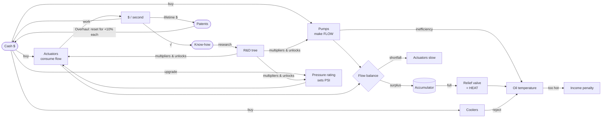

# Pressure Works — Game Design Document

> Working title. Other names on the board: *Full Bore*, *Deadhead*, *Pascal's Empire*, *Relief Valve*.

**Genre:** browser incremental / idle game
**Platform:** desktop and mobile web, no install, no build step
**Session shape:** 30-second check-ins to multi-hour runs, with offline progress
**Status:** design v0.1. A playable prototype ships with this doc (`index.html`).

---

## 1. Elevator pitch

You inherit your grandfather's tire shop and its one rusty bottle jack. Pump by
pump and cylinder by cylinder, you grow it into a hydraulic empire that lifts
ships, forges steel and eventually starts moving mountains.

Most idle games give you one number that goes up. Pressure Works gives you a
**machine you have to keep in balance**: pumps make **flow**, the hose rating
sets **pressure**, actuators turn flow × pressure into **money**, and every
inefficiency comes back as **heat**. The numbers get absurd, but the trade-offs
are the ones a real hydraulic engineer deals with.

## 2. Design pillars

1. **The system is the toy.** Every purchase changes a visible, animated circuit.
   Players should *see* a starved cylinder stall, a relief valve spit red oil and
   the temperature needle creep into the red zone.
2. **Two-sided build.** Supply (pumps) and demand (actuators) both have to grow.
   Overbuilding either side has a clear, readable cost: stalls or heat.
3. **Real physics, idle-game pacing.** The core formulas are the real ones:
   `HP = PSI × GPM / 1714` and `F = P × A`. We bend them for fun, but we don't
   break them. A player should come away knowing what an unloading valve does.
4. **Respect the player's time.** Offline progress, no punishing failure states,
   automation is something you earn, and active play pays without being required.
5. **Shop-floor charm.** Flavor text, a gruff industrial look, and the satisfying
   *chunk* of heavy machinery.

## 3. Core loop



**Second to second:** stroke the hand pump, watch the gauges, fire Surge when the accumulator is full.
**Minute to minute:** buy actuators, keep pumps ahead of demand, add cooling before the oil cooks.
**Hour to hour:** re-rate the system to higher pressure, push through the R&D tree, chase the next era.
**Day to day:** Overhaul for Patents and rebuild faster.

## 4. Resources

| Resource | Symbol | Source | Sink | Persists through Overhaul? |
|---|---|---|---|---|
| Cash | `$` | Actuators doing work; hand-pump strokes | Equipment, re-rating, accumulator, coolers | No |
| Flow | GPM | Pumps | Actuators (a rate, not a stockpile) | — |
| Pressure | psi | System rating tier | — (a multiplier and a gate) | No |
| Accumulator charge | gal | Surplus flow; hand-pump strokes | Shortfalls; Surge | No |
| Heat / oil temp | °F | Pump inefficiency; flow dumped over the relief valve | Coolers, base reservoir | No |
| Know-how | KH | `0.04 × √(income)` per second | R&D | No |
| Patents | — | `√(lifetime $ / 1M)` | Never spent: permanent +10% income each | **Yes** |

## 5. Systems

### 5.1 Flow balance (the heart of the game)

Every actuator has a flow demand in GPM. Every pump adds supply.

- **Supply ≥ demand:** every actuator runs at full speed. The surplus charges
  the accumulator. Once it is full, the surplus goes **over the relief valve**,
  and that is pure heat: `HP = PSI × surplus / 1714`.
- **Supply < demand:** the accumulator covers the gap while it has charge.
  After that, every actuator slows to `supply / demand` speed.

This gives players a constant, legible puzzle: *the flow bar should sit just to
the right of the demand marker.* The UI shows the demand marker on the flow bar,
the relief line glows red when dumping, and the cylinder animation slows when starved.

### 5.2 Pressure rating

The system's pressure comes from its weakest component: hoses, fittings, seals
and the relief-valve setting. Upgrading the rating is a big, chunky purchase that

- **gates** new actuators (an excavator needs 2,800 psi; a forging press 4,500), and
- **multiplies** income from every running actuator by `√(system psi / required psi)`.
  More pressure means more force from the same cylinder. The square root keeps
  early actuators from growing without limit.

Tiers: Rubber Hose (750) → 1-Wire Braid (1,500) → 2-Wire Braid (3,000) →
4-Spiral (5,000) → 6-Spiral (6,000) → Ultra-High Pressure (10,000).
Later tiers need research first: you can't run 5,000 psi on nitrile seals.

The catch: heat scales with pressure too. A re-rate makes every pump's losses
bigger, so a pressure upgrade often has to come with a cooling upgrade.

### 5.3 Heat

```
heat (HP)   = Σ pump power × (1 − efficiency)  +  relief-valve dump × relief factor
k (HP/°F)   = 0.25 (bare reservoir) + Σ coolers
T_equilibrium = 80°F + heat / k
```

Oil temperature eases toward equilibrium (τ ≈ 15 s). Above the limit (140°F,
raised by High-VI Oil and Synthetic Fluid) income falls by 1% per °F, down to a
floor of ×0.2. Heat never destroys anything. It is a soft cap that tells the
player to buy coolers, better pumps or less surplus flow.

Better pumps are more efficient (gear 80% → digital displacement 97%), so pump
choice is about heat as well as flow per dollar.

### 5.4 Accumulator and Surge

A nitrogen-charged accumulator stores surplus flow (it starts at 5 gal and the
bladder upgrades ×2.5 each). It has two jobs:

- **Buffer:** it covers shortfalls automatically, which smooths out
  "I just bought a big actuator" moments.
- **Surge:** when it is full, dump it for **×3 income for 15 s** (×4 after Nitrogen
  Precharge). This is the main active-play reward, and it is automated later by
  *PLC Automation*.

### 5.5 Hand pump (the clicker)

Each stroke gives $1 plus 0.25 gal of accumulator charge, and after *Mechanical
Advantage* also 3% of income per second. It matters most in the first five
minutes and stays useful for topping off the accumulator before a Surge.
Space bar strokes; S fires Surge.

### 5.6 Milestones

Every pump and actuator line doubles its output at 25, 50, 100, 200, 300, 400
and 500 owned. A thin progress bar under each row shows the next one, which gives
players a reason to keep buying cheap lines instead of only the newest one.

### 5.7 R&D (Know-how)

Know-how trickles in at `0.04 × √(income)` per second. It's tied to income, but
the square root keeps it from snowballing. The tree has 17 nodes in 8 stages;
see [TECH_TREE.md](TECH_TREE.md). Research gives the big multipliers, raises the
heat limit, unlocks pressure tiers and pumps, and adds quality-of-life
(PLC auto-surge, telematics offline bonus).

### 5.8 Overhaul (prestige)

Once lifetime earnings reach $1M, the player can **Overhaul**: strip the shop
to the slab and rebuild. Everything resets except **Patents**:

```
patents_total = floor( √(lifetime $ / 1,000,000) )
income multiplier = 1 + 0.10 × patents
```

The first Overhaul pays 1 patent; a run that reaches $1B pays about 31. The
square root means each later run needs much more lifetime earnings to pay off,
which keeps prestige timing an interesting choice instead of an obvious one.

### 5.9 Offline progress

When the player comes back, the game credits steady-state income (equilibrium
temperature, no Surges) at 50% for up to 8 h. *Telematics* raises that to 100%
for up to 24 h. A toast summarises what the shop earned while they were away.

## 6. Progression arc (eras)

| Era | Name | Rough time (first run) | Signature content | New idea introduced |
|---|---|---|---|---|
| I | **The Tire Shop** | 0–10 min | Bottle jacks, log splitters, gear pumps | Flow vs demand, the hand pump |
| II | **The Job Shop** | 10–45 min | Shop presses, excavator arms, vane & axial pumps | Pressure tiers, heat, first research |
| III | **The Factory** | 45 min–1.5 h | Injection molding, forging presses, radial pumps | Cooling wall, proportional & servo control |
| IV | **Heavy Civil** | 1.5 h+ / run 2 | Ship lifts, load-sensing pumps | Overhaul and Patents, automation |
| V | **Megaprojects** | runs 3+ | Tectonic press, digital displacement, UHP | The absurd: hydraulics at geological scale |
| VI *(planned)* | **Beyond** | — | Dam spillway gates, space-elevator tensioners, a press that makes diamonds | Second prestige layer |

The prototype covers eras I–V. Simulated bot timings are in [ECONOMY.md](ECONOMY.md).

## 7. Planned systems (not in the prototype yet)

Ordered roughly by how much they add per unit of work. See [ROADMAP.md](ROADMAP.md).

1. **Departments: the business is a circuit too.** The headline next system.
   All eleven departments of a fluid-power company (Accounting, Quality,
   Safety, Engineering, Inside Sales, Outside Sales, Management, IT,
   Purchasing, Production, Warehouse) form an **Order Line** that orders flow
   through. The narrowest department caps income, so it's the same balancing
   puzzle as pumps vs actuators, one level up. Engineering splits into Design (R&D),
   Controls (automation) and Project, which builds **Valve-Paks → Base-Paks →
   Sys-Paks** from the shop's own hardware. Full design in
   [DEPARTMENTS.md](DEPARTMENTS.md).
2. **Sys-Pak projects (contracts).** Timed, named jobs ("Steel-mill descaler:
   3 Base-Paks, 6,000 psi, servo control") that pay lump sums and Know-how.
   They give active players goals beyond clicking and replace the earlier
   generic contracts-board idea.
3. **Contamination and filtration (owned by Quality).** Particle count (ISO 4406
   code) rises over time and with more pumps. Dirty oil cuts efficiency and
   raises the chance of wear. Filters are a third thing to balance, next to flow and heat.
4. **Wear and incidents (owned by Safety).** A blown seal or a burst hose takes
   one actuator line offline until it's repaired. These are always recoverable,
   never punishing, and Safety's "days without incident" streak makes avoiding them pay.
5. **Circuit builder.** A small grid puzzle where you place valves (sequence,
   counterbalance, flow divider, regenerative circuit) between pumps and
   actuators for line-specific multipliers. For example, a *regenerative circuit*
   doubles cylinder speed at half the force, which is great for low-psi lines.
6. **Fluids.** Mineral oil → HV → synthetic ester → water-glycol → exotic. Each
   has heat limits and efficiency trade-offs.
7. **Second prestige layer: Standards Committee.** Spend Patents to write
   industry standards (ISO, SAE, NFPA) that change the rules of every future run.
   For example, "SAE J517: all hose tiers cost 50% less".
8. **Achievements and a logbook** with real hydraulic trivia unlocked as you go.

## 8. Presentation

- **Visual language:** shop-floor industrial. Dark steel panels, hydraulic-oil
  amber for flow, pressure red, coolant blue. Equipment icons follow ISO 1219
  schematic symbols so the art doubles as a primer.
- **The live schematic** is the main screen's hero. Flow dashes speed up with
  GPM, the cylinder strokes with work rate, the relief line lights red when it's
  dumping, and the tank oil darkens as it heats.
- **Gauges, not just numbers:** analogue pressure and temperature dials with red zones.
- **Audio (planned):** pump whine pitch tracks flow; relief-valve squeal when
  dumping; a deep *thunk* on each Surge; muted shop ambience.

See [sketches/](sketches/) for wireframes and diagrams.

## 9. Real-world hydraulics cheat sheet

The formulas the game is built on, so content stays believable:

| Quantity | Formula (US units) | Used for |
|---|---|---|
| Hydraulic horsepower | `HP = PSI × GPM / 1714` | Heat from pumps and relief dumping |
| Cylinder force | `F (lb) = P (psi) × A (in²)` | Why pressure multiplies income |
| Cylinder speed | `v (in/min) = 231 × GPM / A (in²)` | Why flow is demand |
| Pump flow | `GPM = displacement (in³/rev) × RPM / 231` | Flavor for pump tiers |
| Heat rejection | `Q = U × A × ΔT` | Coolers as a k-value (HP/°F) |
| Pascal's principle | Pressure in a confined fluid acts equally in all directions | First tech node |

A typical industrial system runs at 2,000–3,000 psi, excavators at
4,000–5,000 psi and ultra-high-pressure tools above 10,000 psi. Mineral oil
starts to break down above roughly 180°F. The game's numbers start realistic
and escalate from there.
