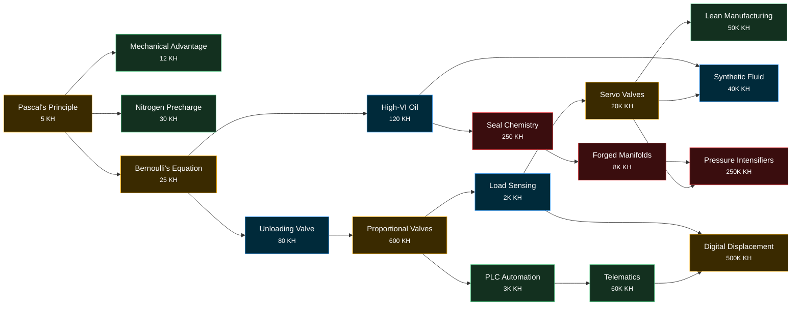

# R&D Tree

Research costs **Know-how (KH)**, which accrues at `0.04 × √(income)` per second.
Each node is a real hydraulic breakthrough, and the game effect follows from
what the technology actually does.

Legend: **amber** = income/flow multipliers · **blue** = heat management ·
**red** = unlocks a pressure tier · **green** = quality of life / economy.

## Nodes

| Node | Cost | Requires | Effect | The real thing |
|---|---:|---|---|---|
| Pascal's Principle | 5 | — | Actuators +25%; unlocks 2-Wire Braid | Pressure in a confined fluid acts equally everywhere, so a small piston can lift a big one. |
| Mechanical Advantage | 12 | Pascal | Strokes earn +3% of income/s | Longer pump handle, more force per stroke. |
| Nitrogen Precharge | 30 | Pascal | Accumulator ×3; Surge ×4 | Pre-charged gas bladders store far more usable fluid. |
| Bernoulli's Equation | 25 | Pascal | Pumps +25% flow | Smarter line sizing means less pressure drop. |
| Unloading Valve | 80 | Bernoulli | Relief heat ×0.35 | Dumps idle pump flow to tank at near-zero pressure instead of across the relief. |
| High-VI Oil | 120 | Bernoulli | Heat limit +20°F | A high viscosity index keeps oil thick when hot. |
| Seal Chemistry | 250 | High-VI Oil | Unlocks 4-Spiral (5,000 psi) | PTFE and Viton survive pressures and temperatures nitrile can't. |
| Proportional Valves | 600 | Unloading | Actuators ×1.5 | Metered, ramped motion instead of bang-bang on/off. |
| Load Sensing | 2K | Proportional | Relief heat ×0.3; unlocks LS pump | The pump senses the highest load pressure and makes only what's needed. |
| PLC Automation | 3K | Proportional | Auto-Surge | Ladder logic runs the machine. |
| Forged Manifolds | 8K | Seal Chemistry | Unlocks 6-Spiral (6,000 psi) | Valves bolted to one forged block: no hoses to burst. |
| Servo Valves | 20K | Load Sensing | Actuators ×2 | Closed-loop position control, accurate to microns. |
| Synthetic Fluid | 40K | High-VI, Servo | Heat limit +40°F | Ester fluids resist thermal breakdown. |
| Lean Manufacturing | 50K | Servo | All costs ×0.85 | Kaizen, kanban, and cutting waste. |
| Telematics | 60K | PLC | Offline 100%, up to 24 h | Remote monitoring of every pump. |
| Pressure Intensifiers | 250K | Forged, Servo | Unlocks UHP (10,000 psi) | Area ratio: a big low-pressure piston drives a small high-pressure one. |
| Digital Displacement | 500K | Load Sensing, Telematics | Pumps ×1.5; unlocks DD pump | Each piston chamber is switched by its own fast solenoid valve. |

## Ideas for future nodes

Grouped by the branch they'd extend.

**Control:** Pilot-Operated Checks (Surge lasts +5 s) · Counterbalance Valves
(no utilization loss below 95%) · Electro-Hydraulic Actuators (actuators no
longer need central flow: a decentralised branch) · Digital Twin (forecasts
offline earnings at 110%).

**Fluid & heat:** Water-Glycol (fire-resistant; needed for the Forge in a
"realism" mode) · Kidney-Loop Filtration (pairs with the contamination system) ·
Reservoir Baffles (+50% base heat rejection) · Heat Recovery (turn waste heat
into a small income stream; a very satisfying "turn the problem into a
resource" moment).

**Power:** Regenerative Circuits (low-psi actuators ×2 speed) · Variable-Speed
Drives (pump η +3%) · Hydraulic Hybrids (energy recovery from lowering loads).

**Scale:** Water Hydraulics (Ship Lift ×3; Victorian London ran a citywide
pressurised-water power network) · Isostatic Pressing (new actuator: 30,000 psi) · Hydraulic Fracturing (new
era, maybe a moral-choice flavor beat) · Geo-Press (Tectonic Press ×10).
