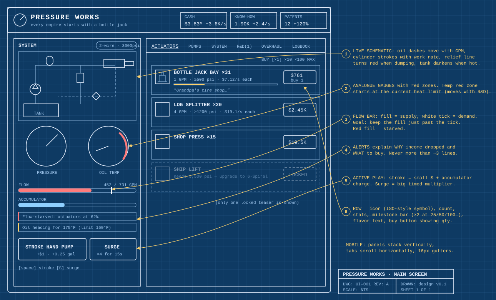
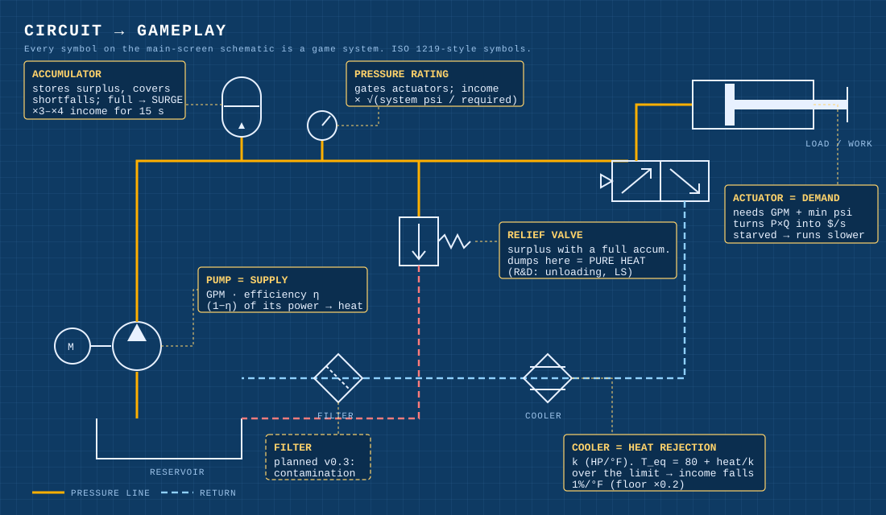
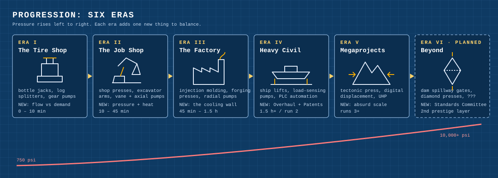
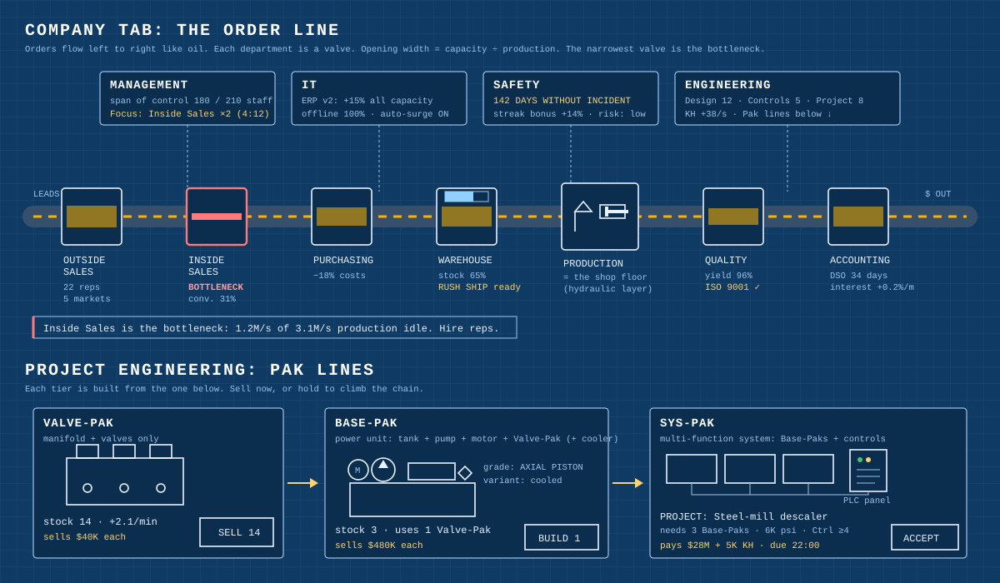
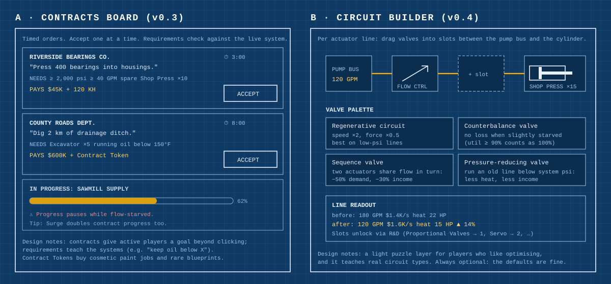

# Sketches

These are blueprint-style concept drawings. They're SVGs, so they render
right here on GitHub and can be edited by hand.

| Sketch | What it shows |
|---|---|
| [ui-wireframe.svg](ui-wireframe.svg) | Main screen layout with numbered design callouts |
| [circuit-to-gameplay.svg](circuit-to-gameplay.svg) | Each component on the live schematic and the game system it represents |
| [era-map.svg](era-map.svg) | The six-era progression arc |
| [departments.svg](departments.svg) | The planned Company tab: the Order Line of departments and the Valve-Pak → Base-Pak → Sys-Pak chain |
| [future-screens.svg](future-screens.svg) | Early concepts for the contracts board and the circuit builder |

